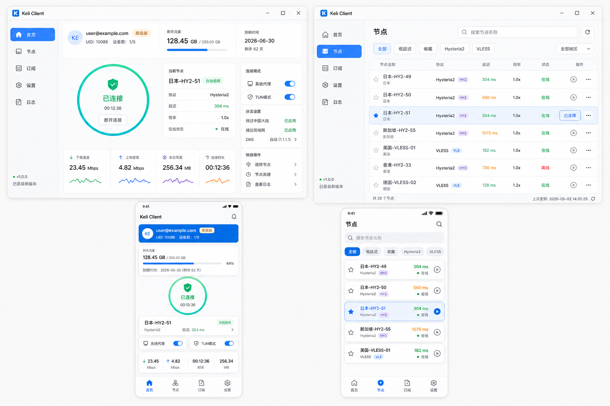

# Keli Client

Keli Client 是 Keli/Xboardpro 体系里的用户代理客户端项目。
它不是节点端程序，也不是 `kelinode` 的替代品；它负责登录 `keliboard`、拉取套餐和节点、请求 sing-box 配置，并在本机启动代理核心。

## 当前状态

这个目录是客户端项目工作区和规格基线。当前已经固化：

- 架构方案
- API 契约
- 产品边界
- UI 规范
- 平台约束
- 开发路线
- UI 概念图

后续真正写 Flutter、Windows helper、Android `VpnService` 代码时，都应该按这里的约束推进。

## 目标平台

- Windows 优先
- Android 第二阶段
- macOS 后续可选
- iOS 明确不做

## 推荐技术栈

- UI: Flutter
- 代理核心: sing-box
- Windows 平台桥接: native helper，负责进程、系统代理、TUN、更新
- Android 平台桥接: Kotlin `VpnService`
- API 来源: 现有 `keliboard` 用户 API

## 项目结构

```text
keli-client/
|-- app/                  Flutter 应用
|-- core-manager/         核心生命周期管理
|-- platform/
|   |-- windows/          Windows helper 说明
|   `-- android/          Android VPNService 说明
`-- docs/
    |-- assets/           UI 图和视觉资产
    |-- architecture.md
    |-- api-contract.md
    |-- product-boundary.md
    |-- ui-spec.md
    `-- roadmap.md
```

## UI 概念图

第一版视觉方向保存在：



## 第一版 MVP

第一版可用客户端应包含：

- 邮箱密码登录
- Token 安全保存
- 用户套餐和节点信息加载
- 客户端内套餐展示和购买
- 节点列表
- 延迟测试
- 单节点连接和断开
- Windows 系统代理模式
- Windows TUN 模式，前提是权限流程处理干净
- Android VPN 模式
- 基础日志和诊断

## 第一版不做

- iOS
- 管理后台功能
- 完整订单和支付中心
- 工单系统
- 邀请和佣金流程
- 完整自定义规则编辑器
- 客户端自己解析所有协议，优先由面板生成 sing-box 配置

## 验证

本地改动至少运行：

```powershell
.\scripts\verify.ps1
```

涉及 Android 原生桥接或 VPN 流程时运行：

```powershell
.\scripts\verify.ps1 -BuildAndroid
```

涉及 Windows helper、系统代理或桌面启动流程时运行：

```powershell
.\scripts\verify.ps1 -BuildWindows
```

GitHub Actions 会在 `app/**`、`docs/**`、`README.md` 变更时自动执行 Flutter analyze、Flutter test、Android debug build 和 Windows debug build。完整 Android 模拟器安装和 `KeliVpnService` 启动 smoke 仍保留在手动 workflow，避免普通 PR 每次都拉取原生核心和启动模拟器。

## 会话安全

客户端保存登录会话时会优先保护 `auth_data`：

- Windows: 使用当前 Windows 用户的 DPAPI 保护。
- Android: 使用 Android Keystore AES-GCM 保护。

旧版本已经写入的明文 `session.json` 仍可读取；用户重新登录或会话重新保存后会迁移为受保护字段。
